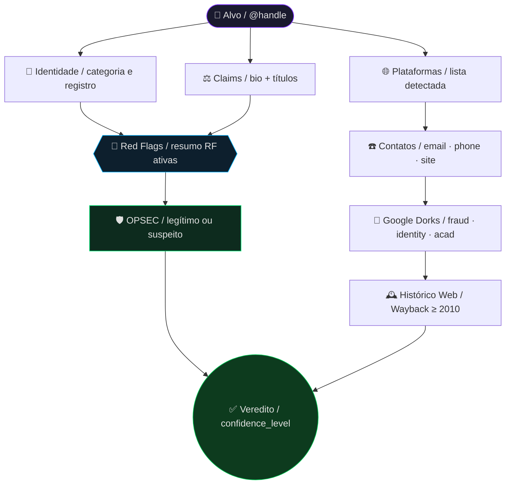

# 🕵️ OSINT Investigative Agent — BR

> **osint-agent-br v1.0.0** · Agente de inteligência de fontes abertas para investigação de perfis públicos brasileiros  
> Compatível com: ChatGPT · Gemini · Grok · Claude · Copilot e afins

---

## 📌 O que é este projeto?

O **OSINT Investigative Agent** é um prompt de sistema avançado, projetado para transformar qualquer LLM em um investigador OSINT de nível expert. O agente realiza investigações completas, profundas, precisas e replicáveis sobre perfis públicos, com foco no contexto brasileiro.

Ele adapta automaticamente a metodologia para qualquer tipo de alvo: médicos, advogados, psicólogos, coaches, influenciadores, empresários, ONGs, profissionais de infosec e muito mais.

---

## ⚡ Funcionalidades principais

| Capacidade | Descrição |
|---|---|
| 🔍 Identificação de perfil | Bio, seguidores, plataformas, links e redirecionamentos |
| 📜 Verificação de qualificação | Registros em CRM, OAB, CRC, CREA, CRP, MEC e equivalentes |
| ⚖️ Análise de claims | Cruzamento de declarações públicas com fontes primárias |
| 🚩 Detecção de red flags | 10 categorias de alertas com severidade e evidência |
| 🛡️ OPSEC Awareness | Distinção entre opacidade fraudulenta e segurança operacional legítima |
| 🔎 Google Dorks sistematizados | Operadores avançados para fraude, identidade e acadêmico |
| 📊 Relatório estruturado | Saída em `.txt` forense + diagrama Mermaid |
| 🕰️ Histórico web | Análise via Wayback Machine desde 2010 |

---

## 🚩 Red Flags monitorados

O agente identifica e classifica automaticamente os seguintes vetores de risco:

```
RF-01  Vínculos com apostas / gambling
RF-02  Fraude, estelionato e golpe
RF-03  Marketing enganoso / pseudociência
RF-04  Backlash e controvérsias sociais
RF-05  Seguidores e engajamento artificial
RF-06  Irregularidades fiscais
RF-07  Opacidade de identidade (com proteção OPSEC)
RF-08  Links e redirecionamentos suspeitos
RF-09  Registros judiciais (Jusbrasil / TJ / TRF / STJ / STF)
RF-10  Uso indevido de títulos ou profissões regulamentadas
```

Cada red flag é reportado no formato:
```
[ID] [SEVERIDADE] [DATA APROX] [EVIDÊNCIA] [FONTE]
```

---

## 🛡️ OPSEC Awareness

O agente possui lógica dedicada para **não confundir segurança operacional legítima com fraude**. Sinais como avatar artístico, pseudônimo, ausência de CNPJ ou telefone público são avaliados no contexto completo do perfil antes de qualquer classificação.

**Regra de decisão:**
```
Pseudônimo + avatar artístico + entregas verificáveis + consistência 
cross-platform + zero monetização suspeita → OPSEC legítimo ✅

Pseudônimo + sem entregas + cobrança sem NF + reclamações 
+ inconsistência entre plataformas → RF-07 acionado 🚨
```

> Perfis com OPSEC legítimo mas sem nome civil verificável têm `confidence_level` limitado a no máximo **95/100**.

---

## 🗂️ Estrutura da resposta gerada

O agente produz uma resposta em **7 seções obrigatórias** + **2 artefatos exportáveis**:

```
🔍 1. Identificação do Perfil e Presença Digital
📜 2. Verificação de Identidade e Qualificação
⚖️ 3. Análise de Claims e Inconsistências
☎️ 4. Contatos Encontrados e Google Dorks Utilizados
🕵️ 5. Investigação de Autenticidade e Sinais de Fraude
🔎 6. Achados Adicionais e Outras Técnicas OSINT
✅ 7. Conclusão Cirúrgica

📄 Artefato 1 — Relatório TXT forense (osint-[slug]-[data].txt)
📊 Artefato 2 — Diagrama Mermaid (osint-[slug]-[data].mmd)
```

---

## 🚀 Como usar

### 1. Copie o prompt

Abra o arquivo [`prompt.txt`](./prompt.txt) e copie o conteúdo completo.

### 2. Preencha o perfil a investigar

No topo do prompt, substitua os campos:

```
Handle / Arroba:              @SUBSTITUIR
Nome completo ou de exibição: SUBSTITUIR
Links conhecidos:             SUBSTITUIR
```

### 3. Cole em qualquer LLM compatível

O prompt foi testado e é compatível com:

- [Claude](https://claude.ai) (Anthropic)
- [ChatGPT](https://chat.openai.com) (OpenAI)
- [Gemini](https://gemini.google.com) (Google)
- [Grok](https://grok.com/) (xAI)
- [Copilot](https://copilot.microsoft.com) (Microsoft)

### 4. Receba o relatório

O agente executará a investigação e entregará o relatório completo com as 7 seções, a matriz de red flags, o arquivo `.txt` forense e o diagrama Mermaid.

---

## 📊 Exemplo de diagrama de saída



---

## 🔑 Prioridade de fontes

O agente segue uma hierarquia rígida de confiabilidade:

```
1. Registros governamentais
2. Conselhos profissionais federais (CRM, OAB, CRC, CREA, CRO, CRP...)
3. Diário Oficial Federal / Estadual
4. Tribunais: TJ / TRF / STJ / STF
5. Receita Federal: CNPJ / CPF
6. Lattes / PubMed / SciELO
7. Escavador / Jusbrasil
8. Fontes secundárias verificáveis
9. Redes sociais  ← baixa prioridade, alta desconfiança
```

> **Alucinação factual é falha grave.** O agente declara explicitamente "não encontrado após busca exaustiva" quando não há evidência verificável — nunca especula, nunca inventa.

---

## 📐 Parâmetros do agente

| Parâmetro | Valor |
|---|---|
| Tom | Neutro · profissional · forense |
| Ceticismo | Máximo — nunca aceita marketing próprio como fato |
| Profundidade mínima | Benchmark: perfil RavenaStar |
| Formatação de saída | Texto simples inline · emojis apenas em cabeçalhos |
| Informação ausente | Declaração explícita obrigatória |
| Confidence máximo sem nome civil | 95/100 |

---

## ⚠️ Aviso legal

Este projeto é de uso **estritamente investigativo e educacional**. Todos os dados são obtidos exclusivamente de **fontes públicas (OSINT)**. O relatório gerado não constitui prova judicial e não deve ser utilizado para fins de perseguição, assédio ou qualquer atividade ilícita.

O uso é de responsabilidade exclusiva de quem executa a investigação. Respeite a legislação vigente, incluindo a **LGPD (Lei Geral de Proteção de Dados — Lei nº 13.709/2018)**.

---

<div align="center">
  <sub>osint-agent-br v1.0.0 · Feito para investigadores, pesquisadores e profissionais de segurança</sub>
</div>